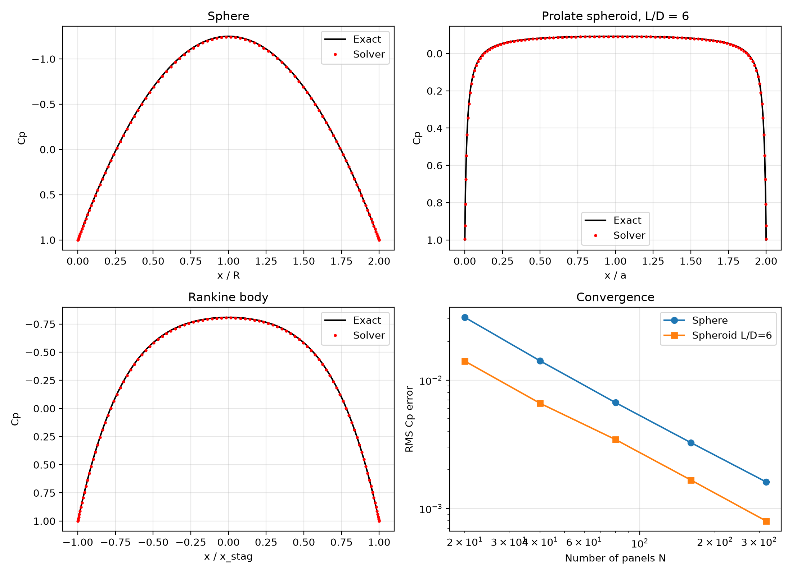
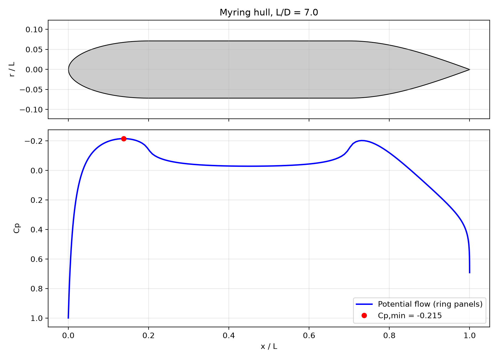

# Potential Flow Over a Torpedo Hull: Cp, Cavitation and Drag in Python
This project shows how far plain potential flow gets you on an AUV-type hull. The solver takes a body of revolution, works out the pressure coefficient along its surface, and uses the minimum Cp to give a rough cavitation inception speed. Drag comes from an empirical correlation, because potential flow on its own gives none. The whole thing runs in about a second per hull, so you can try a nose or tail change before anyone opens a CFD package.


## What the solver does

A hull like this is a body of revolution, so only its outline in the x–r plane matters. I cut the outline into straight panels and put a ring of source density on each one. The velocity a ring induces at any point has a closed form in terms of elliptic integrals (SciPy already has `ellipk` and `ellipe`, which saved a lot of pain), and I integrate along each panel with 8 Gauss points. After that it's one linear system: normal velocity zero at every panel midpoint, solve for the source strengths, add up the velocity at the surface, and Cp = 1 − (Vt/U)². With 200 panels the matrix has a condition number of about 2, so a plain `np.linalg.solve` does the job.

Hull shapes come from three generators in `pfhull.py`: a sphere / prolate spheroid, a Rankine body (uniform stream plus a source and a sink, with the surface found by solving for the zero stream-function line), and a Myring profile, which is the actual torpedo shape. Myring is an elliptical nose, a parallel middle and a parabolic tail, and you set the nose length, tail length and tail angle yourself.

The drag part is borrowed. Friction coefficient from the ITTC-57 line, multiplied by the Hoerner form factor, 1 + 1.5(D/L)^1.5 + 7(D/L)^3. Cavitation inception is simply σi = −Cp,min, and the inception speed follows from the static pressure at whatever depth you pick. Both are rough screening numbers, and I treat them that way.

## Checking it against exact answers

Before running the hull I tried the solver on three bodies where the right answer is known. These are the numbers with 100 panels:

| Body | Cp,min (solver) | Cp,min (exact) | RMS error in Cp |
|---|---|---|---|
| Sphere | -1.2423 | -1.2500 | 5.3e-3 |
| Prolate spheroid, L/D = 6 | -0.0914 | -0.0924 | 2.7e-3 |
| Rankine body | -0.8050 | -0.8092 | 4.3e-3 |

For the sphere and spheroid the exact Cp comes from the added-mass result: surface speed is (1 + k)U times the axial component of the tangent. The Rankine body is checked against its own analytical velocity field. On the plots the solver's dots sit right on the exact lines.

Then I ran 20, 40, 80, 160 and 320 panels to see how the error behaves. It roughly halves each time the panel count doubles, which is what constant-strength panels should do.

| Panels | Sphere | Spheroid |
|---|---|---|
| 20 | 3.09e-2 | 1.41e-2 |
| 40 | 1.41e-2 | 6.59e-3 |
| 80 | 6.68e-3 | 3.44e-3 |
| 160 | 3.26e-3 | 1.67e-3 |
| 320 | 1.61e-3 | 7.98e-4 |



## The hull itself

I used a Myring hull with L = 1 m and D = 0.143 m (L/D = 7), a 0.2 m nose, a 0.3 m tail and a 20 degree tail half-angle. Speed is 5 m/s in seawater (density 1025, kinematic viscosity 1.19e-6) at 10 m depth, with 200 panels.

| Quantity | Value |
|---|---|
| Cp,min | -0.215, at x/L = 0.138 |
| Cavitation inception number | 0.215 |
| Inception speed at 10 m | about 42.6 m/s |
| Reynolds number | 4.2 x 10^6 |
| Cf (ITTC-57) | 0.00351 |
| Hoerner form factor | 1.101 |
| Wetted area | 0.385 m^2 |
| Drag at 5 m/s | 19.05 N |
| CD, wetted / frontal | 0.00386 / 0.0928 |



The Cp curve begins at 1 right at the nose, falls to a suction peak on the forebody (that's the value that sets cavitation inception), goes almost flat along the parallel section, bumps up to a second small peak where the tail starts, and then recovers towards the tip.

## Things that went wrong

My first version put line sources along the axis, Kármán style. It fell apart. The matrix was badly conditioned and Cp on the sphere spiked at the nose. Switching to ring sources spread over the surface fixed it, and the condition number dropped to about 2.

The small kink in the Cp curve at x/L = 0.2 looked like a bug to me at first. It isn't. The Myring profile has a curvature jump exactly where the nose meets the parallel section, and the pressure just follows that.

And a silly one: the scripts write their plots into a `results` folder next to the code, and for a while I thought nothing had been saved because I was looking in the main folder.

## Running it

Everything was run from IDLE on Windows with Python 3.14. We need NumPy, SciPy and Matplotlib and nothing else, so `pip install -r requirements.txt` is the whole setup.

1. Run `validate.py`. It prints the errors above and writes `results/validation.png`.
2. Run `run_hull.py`. It solves the hull in its CONFIG block, prints out a summary, and saves results/hull_cp.png, results/hull_summary.txt and data/potential_cp.csv.
3. To try a different hull, change the numbers at the top of run_hull.py (length, diameter, nose and tail lengths, tail angle, speed, depth) and run it again.
The results and data folders are created (if they don't exist) when running the script.

The `results` and `data` folders get created automatically if they don't exist.

## Limitations

The flow is inviscid, so there's no boundary layer pushing on the pressure and no separation anywhere. Cp over the last few panels at the tail tip is the weakest part of the solution and I wouldn't read much into it.

The drag number isn't computed from the flow at all. It's a correlation, and is only as good as that correlation is, for a hull like this. The cavitation estimate ignores nuclei content and viscous effects, so the inception speed is a screening figure (not a prediction).

The Myring hull has no analytical solution. What I trust about its Cp comes from the exact-solution tests on the other bodies and from the convergence behaviour, not from an independent answer for that exact shape. There's also no free surface, no fins or propeller, and no walls, just an unbounded fluid.

If I come back to this, I'd couple an integral boundary-layer method so pressure and drag include viscous effects, then sweep L/D and nose shape to see how Cp,min moves.

## Repository structure

```
potential-flow-hull/
├── README.md
├── requirements.txt
├── pfhull.py            # geometry, ring-source panel solver, drag and cavitation estimates
├── validate.py          # sphere / spheroid / Rankine checks and the convergence study
├── run_hull.py          # hull analysis, plots, CSV export
├── data/
│   └── potential_cp.csv # Cp vs x/L for the example hull
└── results/
    ├── validation.png
    ├── hull_cp.png
    └── hull_summary.txt
```

## Author

**Pratyush Dash**

B.Tech Chemical Engineering, KIIT University, Bhubaneswar


